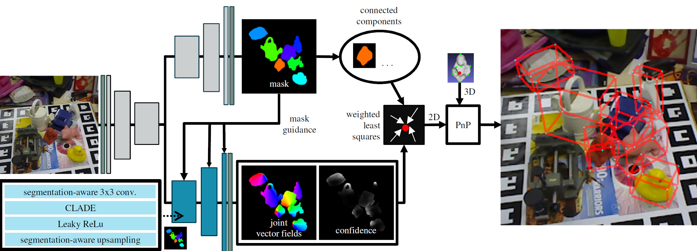

# CASAPose: Class-Adaptive and Semantic-Aware Multi-Object Pose Estimation (BMVC 2022)

## [Project Page](https://bmvc2022.mpi-inf.mpg.de/899/) &nbsp;|&nbsp; [Paper](https://iphome.hhi.de/gard/papers/bmvc2022_gard_hilsmann_eisert.pdf) &nbsp;|&nbsp; [Video](https://youtu.be/MXn34Ye2T5k)



Official code for the BMVC 2022 paper "[Class-Adaptive and Semantic-Aware Multi-Object Pose Estimation](https://iphome.hhi.de/gard/papers/bmvc2022_gard_hilsmann_eisert.pdf)".

## Installation

### Step 1: Setup Conda environment

Setup the environment and install basic requirements using conda. Tensorflow 2.9.1 is compatible with CUDA 11.2 and cuDNN 8.1.

```bash
conda env create -f environment.yml
conda activate casapose
```

### Step 2: Download the pretrained models

```bash
python util_scripts/download_pretrained_models.py 
```

### Step 3: Dataset Preparation

To prepare the datasets replace `/path/to/data/` with the desired output path and call the data preparation script.

```bash
export DATAPATH=~/path/to/data/

# download lmo testset
python util_scripts/prepare_data.py -d $DATAPATH -lmo 

# download lm testset (optional)
python util_scripts/prepare_data.py -d $DATAPATH -lm 

# download lm training data (optional)
python util_scripts/prepare_data.py -d $DATAPATH -pbr

## clean up temporary files when all required datasets have been created correctly (optional) 
rm -r ${DATAPATH}tmp
```

### Step 4: (optional) *Install Docker container*

To setup and run a docker contrainer use in the casapose directory:

```bash
# build docker container
docker build -t "casapose:Dockerfile" .
# single gpu
docker run -it --gpus '"device=0"' --ulimit memlock=-1 --ulimit stack=67108864 \
    --rm --shm-size=2g -e "CUDA_VISIBLE_DEVICES=0" -e "NVIDIA_VISIBLE_DEVICES=0" \
    -v $DATAPATH:/workspace/data -v $(pwd):/workspace/CASAPose casapose:Dockerfile bash
# multi gpu
docker run -it --gpus all --ulimit memlock=-1 --ulimit stack=67108864 \
    --rm --shm-size=2g -v $DATAPATH:/workspace/data \
    -v $(pwd):/workspace/CASAPose casapose:Dockerfile bash
```

Within the Docker container, you can call the training or test scripts in the same way as described in the following.

To train and test our model, we used SLURM and Singularity on a GPU cluster. Our Singularity container is based on the same dependencies as this Docker container.

## Testing

Example to test the 8-object model with Linemod Occlusion Dataset

```bash
python test_casapose.py -c config/config_8.ini \
    --load_h5_weights 1 \
    --load_h5_filename ../../../data/pretrained_models/result_w_8 \
    --datatest $DATAPATH/lmo/test \
    --datameshes $DATAPATH/lmo/models \
    --train_vectors_with_ground_truth 0
```

Append `--save_eval_batches 1` do store visual output.
Use `--outf /path/to/output/sample` to test self-trained model.

Depending on the test system, there may be minimal deviations (<0.1%) of the ADD/S result.

## Training

Example to train 8-object model with pbr data.

```bash
python train_casapose.py -c config/config_8.ini \
    --data $DATAPATH/lm/train_pbr  \
    --datatest $DATAPATH/lm/val_pbr \
    --datameshes $DATAPATH/lm/models
```

Use the `config_8.ini` file to chage other parameters (batchsize, gpus etc.)

## Custom Dataset Generation

This code uses input data in the form of [NNDS](https://github.com/NVIDIA/Dataset_Synthesizer).
Datasets created with [BlenderProc](https://github.com/DLR-RM/BlenderProc) can be converted to a usable format analogous to the examples in "util_scripts/dataset_converter.py".

An explanation how to create compatible datasets with BlenderProc can be found [here](<https://github.com/DLR-RM/BlenderProc/blob/3f40e88b72f272a1d3159849e651d690521f2aae/examples/datasets/bop_challenge/README.mdd>).

For customized datasets, only one instance should be visible per object per image.

## Further Information

This directory contains some features that go beyond the experiments in the paper, but did not provide improved results in initial tests.

* An implementation of [Back-propagatable PnP](https://github.com/BoChenYS/BPnP), which can be used with the `-- use_bpnp_reprojection_loss` parameter.
* A guided upsampling layer using bilinear interpolation. `GuidedBilinearUpsampling` in `casapose.pose_models.models._normalization_layers` .
* Convolution parameter sharing between the two decoders.
* The names of different example architecures can be found in `casapose.pose_models.model_factory` and can be used with the `--modelname` parameter. The easiest way to create a custom configuration is to change `CASAPOSE_PARAMS` in `casapose.pose_models.models.casapose`.

## Citation

If you find this code or our method useful for your academic research, please cite our paper

```bibtex
@inproceedings{Gard_2022_BMVC,
 title        = {CASAPose: Class-Adaptive and Semantic-Aware Multi-Object Pose Estimation},
 author       = {Niklas Gard and Anna Hilsmann and Peter Eisert},
 year         = {2022},
 booktitle    = {33rd British Machine Vision Conference 2022, {BMVC} 2022, London, UK, November 21-24, 2022},
 publisher    = {{BMVA} Press},
 url          = {https://bmvc2022.mpi-inf.mpg.de/0899.pdf}
}
```
